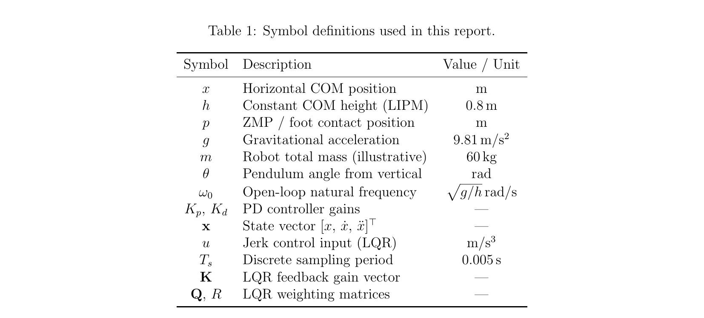
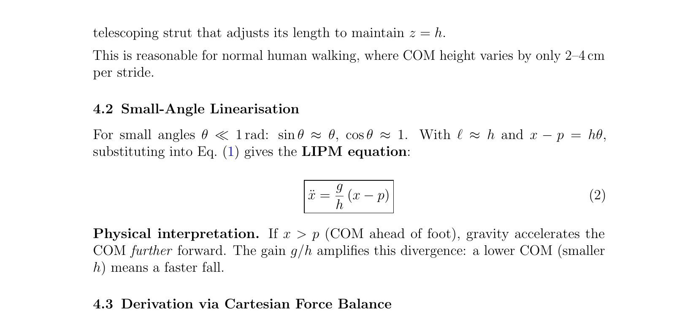
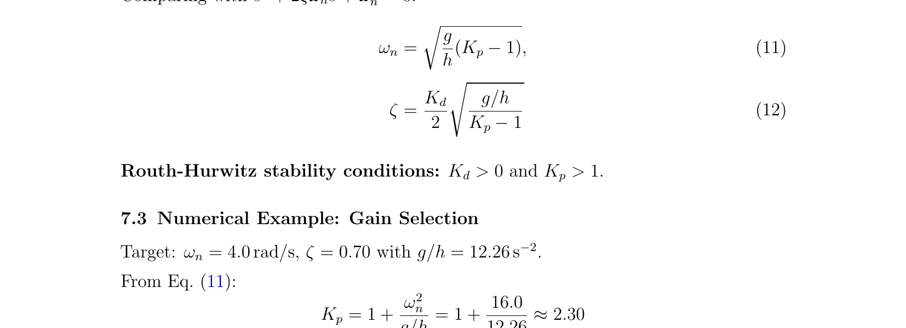
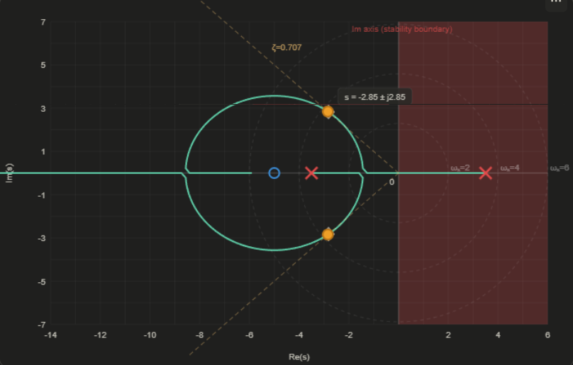
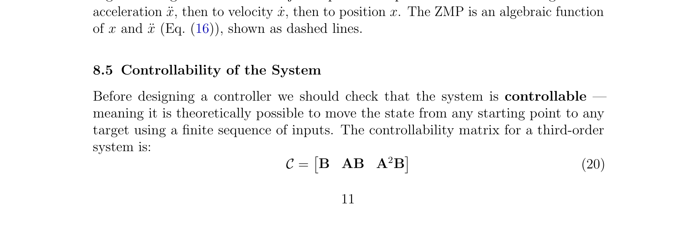
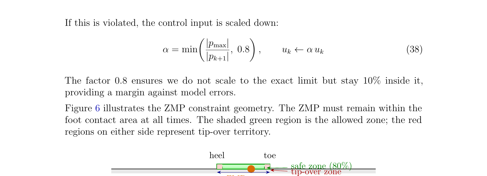
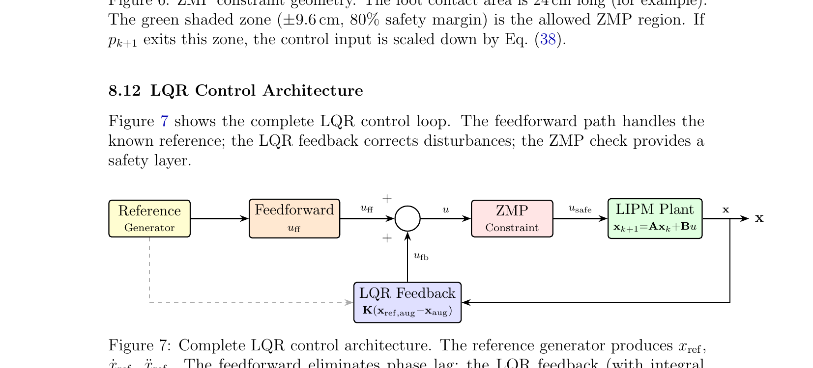
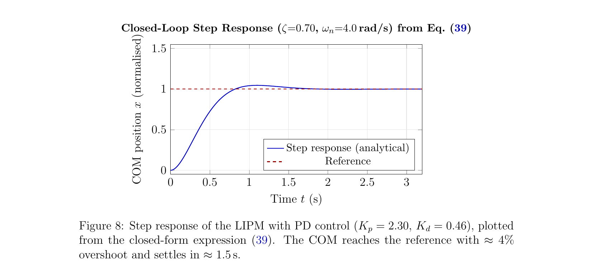
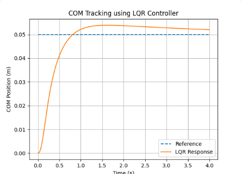
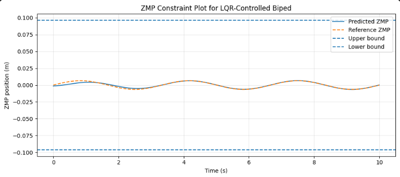

# 🚶 Dynamic Stability of Bipedal Walking (LIPM + LQR)

**Linear Inverted Pendulum Model — PD & LQR Control for Bipedal Balance**


**Course:** Vibrations and Control (ME-354) — Term Project
**Institution:** Indian Institute of Technology Kanpur, Department of Mechanical Engineering
**Semester:** Even Semester, 2025–26

This project studies the dynamic stability of bipedal walking using the **Linear Inverted Pendulum Model (LIPM)**. It derives the model from the full nonlinear pendulum equations, verifies open-loop instability, designs a classical **PD controller** via root locus, then extends to a discrete-time **state-space model with an LQR controller**, connecting both approaches to the **Zero Moment Point (ZMP)** stability criterion.

---

## Table of Contents

- [Abstract](#abstract)
- [Repository Structure](#repository-structure)
- [Getting Started](#getting-started)
- [1. Introduction](#1-introduction)
- [2. Motivation and Real-World Relevance](#2-motivation-and-real-world-relevance)
- [3. Mathematical Model](#3-mathematical-model)
- [4. The Linear Inverted Pendulum Model](#4-derivation-of-the-linear-inverted-pendulum-model)
- [5. Zero Moment Point (ZMP)](#5-zero-moment-point-zmp)
- [6. Transfer Function and Open-Loop Stability](#6-transfer-function-and-open-loop-stability)
- [7. Classical Control: PD Controller Design](#7-classical-control-pd-controller-design)
- [8. Extension: State-Space Model and LQR Control](#8-extension-state-space-model-and-lqr-control)
- [9. Results and Discussion](#9-results-and-discussion)
- [10. Limitations of the Model](#10-limitations-of-the-model)
- [11. Conclusions and Future Scope](#11-conclusions-and-future-scope)
- [Contributors](#contributors)
- [References](#references)

---

## Abstract

This report studies the dynamic stability of bipedal walking using the Linear Inverted Pendulum Model (LIPM). Starting from the full nonlinear inverted pendulum equations, we derive the linearised LIPM under the constant-height walking assumption and verify that the resulting system is open-loop unstable.

The Zero Moment Point (ZMP) is introduced as a practical stability criterion, and a classical PD controller is designed using root locus analysis to stabilise the COM. A numerical example with COM height *h* = 0.8 m is worked out in detail.

We then extend the analysis beyond classical PD control: a discrete-time state-space model using jerk as the control input is derived, the state is augmented with an integral term to eliminate steady-state error, and an LQR controller is designed by minimising a quadratic cost function. The LQR approach is connected to ZMP constraints and compared with PD control.

---

## Repository Structure

```
.
├── README.md
├── requirements.txt
├── src/
│   └── lipm_lqr.py        # Full implementation: LQR design, DARE, control loop
└── images/                 # Figures referenced in this README
```

## Getting Started

```bash
git clone <this-repo-url>
cd <repo-folder>
pip install -r requirements.txt
python src/lipm_lqr.py
```

Running `src/lipm_lqr.py` will:
1. Build the discrete-time triple-integrator state-space model (`A`, `B`, ZMP output row)
2. Check controllability (prints rank = 3)
3. Augment the state with an integral term and solve the Discrete Algebraic Riccati Equation for the LQR gain `K`
4. Confirm closed-loop stability via eigenvalues of `A - B·K`
5. Simulate a step-reference tracking scenario and save three plots: the PD closed-form step response, the LQR COM tracking response, and the resulting ZMP trajectory

---

## 1. Introduction

Walking is something humans do without thinking, but making a robot do the same thing is surprisingly hard. The main challenge is balance: at almost every point during a walking cycle, the robot is supported on only one foot and its centre of mass (COM) is high up. If it leans even slightly too far, gravity accelerates it further in that direction. This is an unstable equilibrium, and it is at the core of why bipedal locomotion is a non-trivial control problem.

A very popular model for this situation is the **Linear Inverted Pendulum Model (LIPM)**, introduced by Kajita and Tani [1]. The LIPM approximates the robot as a point mass on a massless telescoping leg, with the COM constrained to move at a fixed height. Under this assumption the equations of motion simplify to a linear second-order system that can be analysed easily.

This project applies the LIPM to understand and stabilise bipedal walking. We derive the model, analyse its open-loop instability, design a classical PD controller using root locus, and then go a step further: we build a discrete-time state-space model and design an LQR controller. The LQR section draws inspiration from a modern humanoid controller architecture [9] and connects it back to the LIPM framework.

## 2. Motivation and Real-World Relevance

Bipedal robots can navigate environments built for humans: stairs, narrow corridors, rough terrain. But stable walking remains an open research problem. Labs like MIT, CMU, ETH Zurich, and companies like Boston Dynamics publish new walking controllers every year. Even small errors — a mis-timed step, a sensor delay, an unexpected ground irregularity — can cause a 70 kg robot to fall, which is both a safety hazard and expensive.

This is exactly why simplified models like the LIPM are used: they capture the essential instability in a form that is analytically tractable.

Beyond robotics, similar inverted pendulum models appear in prosthetics, exoskeleton design, and biomechanics research on human gait. The control ideas applied here — root locus, state feedback, LQR — are directly relevant to all of these fields.

## 3. Mathematical Model

### 3.1 Coordinate System and Symbols

The analysis works in the sagittal plane (front-to-back motion), which captures the dominant dynamics during forward walking.

| Symbol | Description | Value / Unit |
|---|---|---|
| *x* | Horizontal COM position | m |
| *h* | Constant COM height (LIPM) | 0.8 m |
| *p* | ZMP / foot contact position | m |
| *g* | Gravitational acceleration | 9.81 m/s² |
| *m* | Robot total mass (illustrative) | 60 kg |
| *θ* | Pendulum angle from vertical | rad |
| *ω₀* | Open-loop natural frequency | √(g/h) rad/s |
| *K_p*, *K_d* | PD controller gains | — |
| **x** | State vector [x, ẋ, ẍ]ᵀ | — |
| *u* | Jerk control input (LQR) | m/s³ |
| *T_s* | Discrete sampling period | 0.005 s |
| *K* | LQR feedback gain vector | — |
| *Q*, *R* | LQR weighting matrices | — |

### 3.2 The Inverted Pendulum — Full Nonlinear Model

<p align="center">
  
</p>

> **Figure 1** — Inverted pendulum model of a biped in the sagittal plane. The foot (pivot) is at position *p*, the COM is at horizontal position *x* and height *h*. The angle from vertical is *θ*.

The robot's entire mass *m* is placed at the COM, and the foot acts as the pivot. Applying Newton's second law (or Lagrangian mechanics) for the pendulum of length ℓ pivoting about *p*:

$$m\ell^2\ddot{\theta} = mg\ell\sin\theta$$

**Equation (1)**

where *x = p + ℓ sin θ* and *z = ℓ cos θ*.

## 4. Derivation of the Linear Inverted Pendulum Model

### 4.1 Constant-Height Assumption

In the LIPM the COM is constrained to move at a fixed height *h*, so *z = h = const*, which means *ż = z̈ = 0*. The pendulum leg is no longer rigid; think of it as a massless telescoping strut that adjusts its length to maintain *z = h*.

This is reasonable for normal human walking, where COM height varies by only 2–4 cm per stride.

### 4.2 Small-Angle Linearisation

For small angles θ ≪ 1 rad: sin θ ≈ θ, cos θ ≈ 1. With ℓ ≈ h and *x − p = hθ*, substituting into Equation (1) gives the LIPM equation:

$$\ddot{x} = \frac{g}{h}(x - p)$$

**Equation (2)**

**Physical interpretation.** If *x > p* (COM ahead of foot), gravity accelerates the COM further forward. The gain *g/h* amplifies this divergence: a lower COM (smaller *h*) means a faster fall.

### 4.3 Derivation via Cartesian Force Balance

An equivalent, slightly cleaner derivation avoids angles altogether. The horizontal contact-force component is:

$$m\ddot{x} = F\sin\theta \approx F\frac{x-p}{h}$$

**Equation (3)**

Vertical equilibrium (*z̈ = 0*) gives *F = mg*. Substituting confirms Equation (2):

$$\ddot{x} = \frac{g}{h}(x-p)$$

**Equation (4)**

## 5. Zero Moment Point (ZMP)

The Zero Moment Point is the point on the ground where the net moment from all ground-contact forces is zero — the effective pivot of the whole body.

<p align="center">
  
</p>

> **Figure 2** — The ZMP is the point where the ground reaction force effectively acts. Stability requires the ZMP to remain inside the foot support polygon. If the ZMP exits, the robot tips over.

From the LIPM equation, the ZMP position is:

$$p = x - \frac{h}{g}\ddot{x}$$

**Equation (5)**

The walking controller must keep *p* within the foot's contact area (the support polygon). A common strategy is to plan a desired ZMP trajectory *p_ref(t)* and find the COM trajectory that achieves it [2].

## 6. Transfer Function and Open-Loop Stability

### 6.1 Laplace Transform of the LIPM

Rearranging Equation (2) with *p* as input, *x* as output, and taking the Laplace transform (zero initial conditions), the transfer function is:

$$G(s) = \frac{X(s)}{P(s)} = \frac{-g/h}{s^2 - g/h}$$

**Equation (8)**

### 6.2 Poles and Open-Loop Instability

The poles are:

$$s = \pm\sqrt{g/h} = \pm\omega_0$$

**Equation (9)**

**Numerical example** (*h* = 0.8 m, *g* = 9.81 m/s²):

$$\omega_0 = \sqrt{9.81/0.8} = \sqrt{12.26} \approx 3.50 \text{ rad/s}$$

Open-loop poles: *s* = +3.50 and *s* = −3.50. The RHP pole at *s* = +3.50 means the system is **open-loop unstable**. A 1 cm COM perturbation grows to *e*^(3.50×0.29) ≈ 2.7 cm in just 0.29 s. Without active control, the robot falls in under half a second.

## 7. Classical Control: PD Controller Design

### 7.1 Control Objective and Block Diagram

The COM must track a reference trajectory *x_ref* (planned by the walking pattern generator) while keeping the ZMP inside the support polygon. A feedback controller *C(s)* adjusts the foot placement *p* based on the error *e = x_ref − x*.

<p align="center">
  
</p>

> **Figure 3** — Closed-loop block diagram. The PD controller *C(s)* adjusts foot placement *p* to bring the COM to the reference *x_ref*.

### 7.2 PD Controller Design

With the sign-corrected controller *C(s) = −(K_p + K_d s)*, *K_p, K_d > 0*, the closed-loop characteristic equation is:

$$s^2 + \frac{g}{h}K_d s + \frac{g}{h}(K_p - 1) = 0$$

**Equation (10)**

Comparing with *s² + 2ζω_n s + ω_n² = 0*:

$$\omega_n = \sqrt{\frac{g}{h}(K_p-1)}$$

**Equation (11)**

$$\zeta = \frac{K_d}{2}\sqrt{\frac{g/h}{K_p-1}}$$

**Equation (12)**

**Routh–Hurwitz stability conditions:** *K_d > 0* and *K_p > 1*.

### 7.3 Numerical Example: Gain Selection

Target: *ω_n* = 4.0 rad/s, *ζ* = 0.70 with *g/h* = 12.26 s⁻².

$$K_p = 1 + \frac{\omega_n^2}{g/h} = 1 + \frac{16.0}{12.26} \approx 2.30$$

$$K_d = 2\zeta\frac{\omega_n}{g/h} = 2\times0.7\times\frac{4.0}{12.26} \approx 0.46$$

**K_p = 2.30, K_d = 0.46** → Closed-loop poles: *s = −2.80 ± j2.86* (both in LHP ✓), *ω_n* = 4.0 rad/s, *ζ* = 0.70

### 7.4 Root Locus Analysis

<p align="center">
  
</p>

> **Figure 4** — Root locus for the LIPM with PD control as *K* varies. The cross marks are open-loop poles at *s* = ±3.50. Yellow dots show the chosen closed-loop poles *s* = −2.80 ± j2.86. Both branches enter the LHP for *K* > 2.86.

The two open-loop poles start at *s* = ±3.50. As *K* increases, the RHP pole moves left; above *K* = 2.86 both poles are in the LHP and the system is stable.

## 8. Extension: State-Space Model and LQR Control

### 8.1 Why Go Beyond PD Control?

The PD controller stabilises the LIPM effectively around a fixed reference. However, during walking the reference trajectory *x_ref(t)* is time-varying — the planner continuously updates where the COM should be. A PD controller responds only to the current error *e = x_ref − x*; it has no knowledge of where the reference is going next. This reactive nature introduces a **phase lag**: the COM consistently trails the reference, and over several steps this lag can push the ZMP dangerously close to the edge of the support polygon.

A more systematic approach is to model the system in **state space** and use an **LQR (Linear Quadratic Regulator)** controller, which finds the optimal feedback gains by solving an optimisation problem rather than by hand-tuning.

### 8.2 Why State Space? Why Jerk?

The transfer function *G(s)* is convenient for stability analysis and root locus, but becomes awkward when the reference is time-varying, when velocity/acceleration need to be penalised, when integral action is needed for steady-state error correction, or when the controller runs on a digital processor at a fixed sampling rate. A state-space model handles all of these naturally.

**Why jerk as the input?** From the ZMP formula *p = x − (h/g)ẍ*, the ZMP depends directly on COM acceleration. Commanding acceleration directly can produce instantaneous force jumps — unrealistic for a physical actuator. Instead, acceleration is made a *state* and its derivative (jerk) is commanded:

$$u = x^{(3)} \quad \text{(jerk, units: m/s}^3\text{)}$$

This gives smooth COM trajectories via the **triple integrator**:

$$x^{(3)} = u \;\to\; \ddot{x} = \int u\,dt \;\to\; \dot{x} = \int \ddot{x}\,dt \;\to\; x = \int \dot{x}\,dt$$

**Equation (13)**

with state vector **x** = [x, ẋ, ẍ]ᵀ.

### 8.3 Continuous-Time State-Space Model

$$\dot{\mathbf{x}} = A_c\,\mathbf{x} + B_c\,u, \qquad A_c = \begin{bmatrix}0&1&0\\0&0&1\\0&0&0\end{bmatrix}, \quad B_c = \begin{bmatrix}0\\0\\1\end{bmatrix}$$

**Equation (15)**

The ZMP output is computed algebraically from the state:

$$p = C_{ZMP}\,\mathbf{x} = x - \frac{h}{g}\ddot{x}, \qquad C_{ZMP} = \begin{bmatrix}1 & 0 & -h/g\end{bmatrix}$$

**Equation (16)**

With *h* = 0.8 m and *g* = 9.81 m/s²: *h/g* = 0.0815 s².

### 8.4 Discrete-Time Formulation

Digital controllers run at a fixed clock rate, so the continuous model is discretised using a zero-order hold (ZOH) with sampling period *T_s* = 0.005 s (200 Hz, a typical rate for humanoid balance controllers [4]). For a triple integrator, the ZOH discretisation has a closed-form result:

$$\mathbf{x}_{k+1} = A\mathbf{x}_k + Bu_k$$

**Equation (17)**

$$A = \begin{bmatrix}1 & T_s & T_s^2/2\\0&1&T_s\\0&0&1\end{bmatrix}, \qquad B = \begin{bmatrix}T_s^3/6\\T_s^2/2\\T_s\end{bmatrix}$$

**Equation (18)**

Numerical values with *T_s* = 0.005 s:

$$A = \begin{bmatrix}1 & 0.005 & 1.25\times10^{-5}\\0&1&0.005\\0&0&1\end{bmatrix}, \qquad B = \begin{bmatrix}2.08\times10^{-8}\\1.25\times10^{-5}\\0.005\end{bmatrix}$$

**Equation (19)**

The very small values in *B* for position and velocity make physical sense: a 5 ms jerk pulse barely moves the position or velocity directly, but its effect accumulates over many steps to produce smooth motion.

<p align="center">
  
</p>

> **Figure 5** — Signal chain for the jerk-input state-space model. Jerk *u* integrates to acceleration ẍ, then to velocity ẋ, then to position *x*. The ZMP is an algebraic function of *x* and *ẍ* (Equation 16).

### 8.5 Controllability of the System

The system is controllable if and only if the controllability matrix *C = [B, AB, A²B]* has rank 3. For the triple integrator, this always holds — the *B₃ = T_s* entry ensures jerk directly reaches the acceleration state, and *A* couples acceleration to velocity and position:

$$\mathcal{C} = \begin{bmatrix}B & AB & A^2B\end{bmatrix}, \qquad \text{rank}(\mathcal{C}) = 3 \;\checkmark$$

**Equation (21)**

Full controllability means the LQR optimisation problem is well-posed and will always yield a stabilising gain matrix.

### 8.6 Augmenting the State with Integral Action

A pure state-feedback controller *u = −Kx* will drive the state to zero, but will not necessarily drive it to a non-zero reference without steady-state error. A fourth state *x_I* accumulates the position error over time:

$$x_I(k+1) = x_I(k) + T_s\big(x_{ref}(k) - x(k)\big)$$

**Equation (22)**

If *x(k)* is consistently below *x_ref(k)*, then *x_I* grows and the controller applies extra jerk to correct the drift. The augmented system matrices are:

$$A_{aug} = \begin{bmatrix}A & 0\\-T_s\,c & 1\end{bmatrix}, \qquad B_{aug} = \begin{bmatrix}B\\0\end{bmatrix}$$

**Equation (24)**

where *c = [1, 0, 0]* selects position from the original state. **Anti-windup clamping** is applied: *x_I ← clip(x_I, −0.1, +0.1)* to prevent overshoot from a large initial error.

### 8.7 LQR Cost Function and Gain Design

The LQR controller minimises the infinite-horizon cost:

$$J = \sum_{k=0}^{\infty}\big(\mathbf{x}_{aug,k}^\top Q\, \mathbf{x}_{aug,k} + R\, u_k^2\big)$$

**Equation (25)**

*Q_ii* penalises the squared error of the *i*-th state; *R* penalises squared jerk input. A dominant *Q* gives an aggressive controller (tight tracking, large jerk); a dominant *R* gives a gentle controller (small inputs, more lag).

We choose:

$$Q = \text{diag}(10000,\ 1000,\ 1,\ 1000), \qquad R = 0.01$$

**Equation (26)**

- **Q₁₁ = 10000** — position accuracy is paramount
- **Q₂₂ = 1000** — velocity matters, but less than position
- **Q₃₃ = 1** — acceleration deviations lightly penalised
- **Q₄₄ = 1000** — integral state penalised to prevent slow windup
- **R = 0.01** — jerk inputs up to ~10 m/s³ are acceptable

### 8.8 The Discrete Algebraic Riccati Equation

$$P = A_{aug}^\top P A_{aug} - A_{aug}^\top P B_{aug}\big(R + B_{aug}^\top P B_{aug}\big)^{-1} B_{aug}^\top P A_{aug} + Q$$

**Equation (27)**

*P* is the 4×4 symmetric positive-definite cost-to-go matrix. It is solved numerically (`scipy.linalg.solve_discrete_are` — see `src/lipm_lqr.py`). The optimal feedback gain is then:

$$K = \big(R + B_{aug}^\top P B_{aug}\big)^{-1} B_{aug}^\top P A_{aug}$$

**Equation (28)**

### 8.9 Control Law and Closed-Loop Update

At each step, the total control combines feedforward and LQR feedback:

$$u_k = u_{ff} + u_{fb}$$

**Equation (29)**

$$u_{ff} = \frac{\ddot{x}_{ref}(k) - \ddot{x}(k)}{T_s}$$

**Equation (30)**

$$u_{fb} = K\big(\mathbf{x}_{ref,aug,k} - \mathbf{x}_{aug,k}\big)$$

**Equation (31)**

The combined input is saturated at ±10 m/s³ before updating the state via Equation (17).

### 8.10 Closed-Loop Stability via Eigenvalues

The closed-loop system matrix is *A_cl = A_aug − B_aug K*. In discrete time the system is asymptotically stable iff all eigenvalues satisfy |λ_i| < 1. Numerically, with the parameters in Equation (26), all four eigenvalues of *A_cl* have magnitude in the range 0.7–0.95, comfortably inside the unit circle (see `src/lipm_lqr.py` output).

### 8.11 ZMP Constraints in the LQR Framework

After computing *u_k* and predicting *x_{k+1}*, the predicted ZMP is checked:

$$p_{k+1} = C_{ZMP}\,\mathbf{x}_{k+1}$$

**Equation (36)**

For a foot of length 24 cm with an 80% safety margin, the allowed range is *p_{k+1} ∈ [−0.096, +0.096]* m. If violated, the control input is scaled down:

$$\alpha = \min\left(\frac{|p_{max}|}{|p_{k+1}|}, 0.8\right), \qquad u_k \leftarrow \alpha\, u_k$$

**Equation (38)**

<p align="center">
  
</p>

> **Figure 6** — ZMP constraint geometry. The foot contact area is 24 cm long. The green shaded zone (±9.6 cm, 80% safety margin) is the allowed ZMP region; if the predicted ZMP exits this zone, the control input is scaled down by Equation (38).

### 8.12 LQR Control Architecture

<p align="center">
  
</p>

> **Figure 7** — Complete LQR control architecture. The reference generator produces *x_ref, ẋ_ref, ẍ_ref*. The feedforward path eliminates phase lag; the LQR feedback (with integral augmentation) handles disturbances; the ZMP constraint check provides a safety layer before the command reaches the plant.

### 8.13 Comparison: PD vs. LQR

| | PD Controller | LQR Controller |
|---|---|---|
| **Model needed?** | No; responds to measured error only | Yes; requires A, B, h, g, Ts |
| **Design method** | Root locus; poles placed by hand | Solve DARE; poles placed by optimiser |
| **Steady-state error** | Non-zero for ramp references | Zero, with integral augmentation |
| **Phase lag** | Inherent in reactive feedback | Greatly reduced by feedforward term |
| **Tuning parameters** | 2: K_p, K_d | 5 diagonals of Q + 1 value of R |
| **ZMP handling** | Implicit through p command | Explicit predictive check each step |
| **Online computation** | 2 multiplications per step | 4-element dot product per step |
| **Offline work** | Moderate (root locus analysis) | Heavy (solve 4×4 DARE) |
| **Best suited for** | Quick stabilisation, course-level use | Smooth walking, research robots |

The main practical lesson: LQR shifts the design effort offline. During real-time operation the controller is a cheap matrix-vector multiply; the hard work is done once by the DARE solver. For the simple LIPM both controllers give qualitatively similar closed-loop behaviour, but for a robot with 20+ states, manually tuning a PD per variable is impractical, whereas LQR scales gracefully.

## 9. Results and Discussion

### 9.1 Step Response (PD Controller)

With *K_p* = 2.30 and *K_d* = 0.46, the closed-loop poles are at *s = −2.80 ± j2.86* (*ω_n* = 4.0 rad/s, *ζ* = 0.70):

$$x(t) = 1 - e^{-\zeta\omega_n t}\left(\cos\omega_d t + \frac{\zeta\omega_n}{\omega_d}\sin\omega_d t\right), \qquad \omega_d = \omega_n\sqrt{1-\zeta^2} = 2.86 \text{ rad/s}$$

**Equation (39)**

<p align="center">
  
</p>

> **Figure 8** — Step response of the LIPM with PD control (K_p = 2.30, K_d = 0.46). The COM reaches the reference with ≈4% overshoot and settles in ≈1.5 s.

### 9.2 LQR Controller

<p align="center">
  
</p>

> **Figure 9** — Center of Mass tracking using the LQR controller, applied to a step reference trajectory of 0.05 m.

The ZMP trajectory is obtained directly from the simulated state using *p = x − (h/g)ẍ*, with safety bounds at 80% of the foot half-length:

<p align="center">
  
</p>

> **Figure 10** — Predicted ZMP trajectory during walking. The controller keeps the ZMP within the admissible support-polygon bounds of ±9.6 cm.

### 9.3 Key Observations

1. **Open-loop instability is fast.** The RHP pole at *s* = +3.50 rad/s means a 1 cm perturbation grows to ≈2.7 cm in 0.29 s. Without control, the robot falls in under half a second.
2. **PD stabilisation works well.** Closed-loop poles at *s* = −2.80 ± j2.86 give *ζ* = 0.70, settling in ≈1.5 s with ≈4% overshoot. The derivative gain is essential — without *K_d* the poles sit on the imaginary axis for *K_p* = 1.
3. **ZMP stays within bounds.** During the step transient the COM acceleration reaches roughly *ω_n²* = 16 m/s² at peak; the ZMP deviation is at most (h/g)×16 ≈ 1.3 cm, well within the ±9.6 cm safe zone.
4. **LQR adds value for time-varying references.** The feedforward+LQR scheme directly tracks *ẍ_ref* in one step (under ideal conditions), avoiding the phase lag inherent in the PD controller. The integral state eliminates any residual position offset.
5. **Both controllers are limited by the model.** Swing-leg dynamics, double-support phase transitions, and sensor noise are all ignored by the LIPM.

### 9.4 Effect of COM Height on Stability

| h (m) | g/h (s⁻²) | ω₀ = √(g/h) (rad/s) | Required K_p |
|---|---|---|---|
| 0.6 | 16.35 | 4.04 | 1.98 |
| 0.8 | 12.26 | 3.50 | 2.30 |
| 1.0 | 9.81 | 3.13 | 2.63 |
| 1.2 | 8.18 | 2.86 | 2.95 |

A shorter robot falls faster (larger *ω₀*) but needs smaller gains. A taller robot is more forgiving in terms of instability rate but requires more control effort to achieve the same bandwidth.

## 10. Limitations of the Model

The LIPM is elegant and analytically tractable, but involves several simplifications:

1. **Constant COM height** — real COM height varies 2–4 cm per stride; vertical dynamics are ignored entirely.
2. **Point foot** — real feet have finite area; ankle joint dynamics introduce additional degrees of freedom.
3. **Massless legs** — leg mass (≈20–30% of total) significantly affects swing-phase dynamics.
4. **Sagittal plane only** — lateral stability requires a separate analysis.
5. **Small-angle assumption** — the linearisation breaks down for *θ* > 15–20°.
6. **No actuator dynamics** — real servos have bandwidth limits; fast jerk commands may not be achievable.
7. **Perfect state measurement** — the LQR assumes [x, ẋ, ẍ] are known exactly; in practice acceleration is noisy and must be filtered.

## 11. Conclusions and Future Scope

This project derived the LIPM from first principles and studied bipedal balance with two progressively sophisticated controllers.

The core equation *ẍ = (g/h)(x − p)* has a clear physical interpretation and a verifiable instability: a 1 cm COM perturbation grows to 2.7 cm in 0.29 s. A PD controller with *K_p* = 2.30, *K_d* = 0.46, chosen via root locus, places the closed-loop poles at *s* = −2.80 ± j2.86, giving *ω_n* = 4.0 rad/s, *ζ* = 0.70, and settling in ≈1.5 s with negligible ZMP excursion.

The LQR extension showed how reformulating the problem in state space — with jerk as input, position/velocity/acceleration as states, and an integral augmentation — leads to a more systematic and scalable design. The LQR gain is found by solving the Discrete Algebraic Riccati Equation; closed-loop stability is confirmed by checking eigenvalues of *A_cl* inside the unit circle; and a ZMP constraint check at each step ensures the robot stays dynamically balanced.

**Future directions:**

- Extend to 3D walking with lateral dynamics.
- Include swing-leg mass and double-support transitions.
- Add online foot placement via preview control [3].
- Test on a simulation platform (MuJoCo, Gazebo) with a realistic robot model.
- Add a Kalman filter for state estimation under sensor noise — the natural complement to LQR in the LQG framework.

---

## Contributors

| Member | Contribution |
|---|---|
| Naman Mohan Singh | Complete LQR section (state-space model, discrete-time matrices, controllability, augmented state, Riccati equation, stability analysis, comparison table); Appendix A |
| Ashish Kumar Jha | Full derivation of the LIPM from the nonlinear pendulum equations; derivation of ZMP formula |
| Ayush Kiran Badgujar | Literature review, introduction and motivation sections; reference identification |
| Krishna Goyal | Controller design section: PD design, Routh–Hurwitz conditions, gain selection numerics |
| Prasun Shrivastav | Laplace transform analysis, transfer function derivation, open-loop stability analysis; TikZ figures; report formatting |
| Purav Malhotra | Results and discussion section; COM-height table; final proofreading and LaTeX compilation |

*Indian Institute of Technology Kanpur — Department of Mechanical Engineering, ME-354 (Vibrations and Control), Even Semester 2025–26.*

## References

1. S. Kajita and K. Tani, "Study of dynamic biped locomotion on rugged terrain," in *Proc. IEEE ICRA*, 1991, pp. 1405–1411.
2. M. Vukobratović and J. Stepanenko, "On the stability of anthropomorphic systems," *Mathematical Biosciences*, vol. 15, pp. 1–37, 1972.
3. S. Kajita et al., "Biped walking pattern generation by using preview control of zero-moment point," in *Proc. IEEE ICRA*, 2003, pp. 1620–1626.
4. Humanoid IITK Technical Team, "Humanoid Controller Documentation: High-Precision CoM Tracking with ZMP Stability Constraints," Internal report, IIT Kanpur, June 2025.
5. K. Ogata, *Modern Control Engineering*, 5th ed. Prentice Hall, 2010.
6. G. F. Franklin, J. D. Powell, and A. Emami-Naeini, *Feedback Control of Dynamic Systems*, 6th ed. Pearson, 2010.
7. S. S. Rao, *Mechanical Vibrations*, 5th ed. Pearson, 2011.
8. E. R. Westervelt et al., *Feedback Control of Dynamic Bipedal Robot Locomotion*. CRC Press, 2007.
9. M. T. Leines and J.-S. Yang, "LQR control of an underactuated planar biped robot," in *Proc. 6th IEEE ICIEA*, Beijing, China, 2011, pp. 1684–1689.

---

<p align="center"><i>Built with Python, NumPy, SciPy, and Matplotlib.</i></p>
